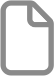

# Visual Studio Code Prépa Workshop Extension
<!-- 
[](https://marketplace.visualstudio.com/items?itemName=qft-rules.prepa-workshop)
[](https://marketplace.visualstudio.com/items?itemName=qft-rules.prepa-workshop)
[](https://marketplace.visualstudio.com/items?itemName=qft-rules.prepa-workshop)

[](https://marketplace.visualstudio.com/items?itemName=qft-rules.prepa-workshop)
[](https://marketplace.visualstudio.com/items?itemName=qft-rules.prepa-workshop)
[](https://marketplace.visualstudio.com/items?itemName=qft-rules.prepa-workshop)
[](https://creativecommons.org/licenses/by/4.0/) -->

[](https://github.com/James-Yu/LaTeX-Workshop/actions?query=workflow%3A%22TeX+Live+on+Windows%22)
[](https://github.com/James-Yu/LaTeX-Workshop/actions?query=workflow%3A%22TeX+Live+on+macOS%22)
[](https://github.com/James-Yu/LaTeX-Workshop/actions?query=workflow%3A%22TeX+Live+on+Linux%22)

# Accueil

[Prépa Workshop](https://marketplace.visualstudio.com/items?itemName=qft-rules.prepa-workshop) est une extension du logiciel [Visual Studio Code](https://code.visualstudio.com/), dont le but est de fournir un espace de travail aux enseignants en CPGE scientifique qui utilisent LaTeX sur [Visual Studio Code](https://code.visualstudio.com/). Vous pouvez me contacter à l'adresse email [eric.brillaux@laposte.net](mailto:eric.brillaux@laposte.net) pour toute question ou remarque. Vous pouvez également reporter des erreurs sur github.


### Dépendances


L'extension [Prépa Workshop](https://marketplace.visualstudio.com/items?itemName=qft-rules.prepa-workshop) nécessite l'extension [Latex Workshop](https://marketplace.visualstudio.com/items?itemName=James-Yu.latex-workshop) de [Visual Studio Code](https://code.visualstudio.com/), ainsi qu'une distribution [TexLive](https://www.tug.org/texlive/) locale.

### Table des matières

- [Accueil](#accueil)
- [Vues arborescentes](#vues-arborescentes)
  - [Banque d'exercices](#banque-exercices)
  - [Programme de colle](#programme-colle)
- [Configurations de l’extension](#configurations-extension)
  - [Paramètres utilisateur](#parametres-utilisateur)
  - [Raccourcis clavier](#raccourcis-clavier)
- [LaTeX](#latex)
  - [Macro LaTeX](#macro-latex)
  - [Configurations LaTeX recommandées](#configurations-latex-recommandees)


<a id="vues-arborescentes"></a>
# Vues arborescentes

L'extension [Prépa Workshop](https://marketplace.visualstudio.com/items?itemName=qft-rules.prepa-workshop) ajoute une icône à la barre des tâches (barre latérale à gauche) appelée CPGE. En cliquant sur l’icône CPGE, visual studio code affiche une liste de vues arborescentes. Ces vues arborescentes sont intitulées : 
 - [banque d'exercices](https://github.com/QFTrules/qftrules.prepaworkshop/wiki/Banque-d'exercices) ;
 - [programme de colle](https://github.com/QFTrules/qftrules.prepaworkshop/wiki/programme-de-colle) (en cours) ;

### Banque d'exercices
Cette vue arborescentes affiche l'ensemble des exercices présents dans le dossier recueil.

### Programme de colle
En cours...

<a id="banque-exercices"></a>
## Banque d’exercices

Cette vue arborescentes affiche l'ensemble des exercices présents dans le dossier recueil dont le chemin d'accès est défini par la variable ```banque.path```. La valeur par défaut de cette variable est le dossier local de l'extension ```./recueil```, qui contient quelques sous-dossiers thématiques et fichiers latex de chapitres d'exercices pour l'exemple. 

### Organisation de la vue arborescente

La vue arborescente est organisée de la façon suivante *(exemple entre parenthèse)* : 
 - thème *(THERMODYNAMIQUE)*
   - chapitre *(conduction thermique)*
     - exercice *(Résolution numérique de la diffusion thermique)*

Cette vue arborescente correspond à une architecture physique du dossier recueil de la forme : 
 - sous-dossier *(thermodynamique)*
   - fichier latex *(conduction thermique.tex)*
      - environnement ```exo``` *(Résolution numérique de la diffusion thermique)*

### Données affiliées aux exercices

Chaque exercice est défini par l'environnement ```exo``` dont la syntaxe est décrite à la section [Macro LaTeX](#macro-latex). Un exercice possède plusieurs paramètres, représentées par des données visuelles différentes dans la vue arborescente. Ainsi l'exercice cité ci-dessus apparaît dans la vue arborescente comme :
  >  Résolution numérique de la diffusion thermique ★★★


Ces données, listées de gauche à droite, sont les suivantes.
 1.   : type d’exercice.
 Le type d'exercice précise de quel nature ou à quel usage se destine l'exercice. Les types d'exercice disponibles sont :

| Type d'exercice | Icône | Argument optionnel associé
|---|---|---|
| Capacité numérique en python |  | python |
| Exercice de travaux dirigé |  | TD |
| Exercice de colle |  | colle |
| Résolution de problème |  | problem |
| Devoir maison ou surveillé, partie d’un devoir, annale |  | devoir |
| Expérience ou illustration expérimentale |  | exp |
| Autre type non reconnu |  | |

 2. Résolution numérique de la diffusion thermique : nom de l’exercice.
 3. ★★★ : difficulté de l’exercice. Le nombre d’étoiles est illimitée.

<a id="programme-colle"></a>
## Programme de colle
En cours...

<a id="configurations-extension"></a>
# Configurations de l’extension

L’utilisateur peut configurer l’extension [Prépa Workshop](https://marketplace.visualstudio.com/items?itemName=qft-rules.prepa-workshop), en modifiant : 
- les [paramètres utilisateurs](https://github.com/QFTrules/qftrules.prepaworkshop/wiki/Paramètres-utilisateur) utilisés par les commandes de l’extension ;
- les [raccourcis clavier](https://github.com/QFTrules/qftrules.prepaworkshop/wiki/Raccourscis-clavier) des commandes de l’extension.

<a id="parametres-utilisateur"></a>
## Paramètres utilisateur
L’extension Prépa Workshop utilise plusieurs paramètres de configurations. Les paramètres, tous modifiables par l’utilisateur, sont les suivants.
- ```banque.path```
  - Valeur par défaut : ```/recueil/```.
  - Définit le chemin d'accès vers le dossier qui contient la banque d’exercices. Il s'agit du dossier local /recueil/ de l'extension  par défaut. Il est vivement recommandé de modifier ce chemin d'accès au profit d'un autre dossier personnel de l'utilisateur. Indiquer dans ce cas un chemin absolu.
- ```banque.exclude```
   - Valeur par défaut : ```/Figures/```.
   - Définit les chemins d'accès relatifs vers les sous-dossiers de *banque.path* qui doivent être exclus de l'affichage dans la vue *banque d'exercices*. 

<a id="raccourcis-clavier"></a>
## Raccourcis clavier
Voici la liste de raccourcis clavier des commandes de l’extension, toutes modifiables par l’utilisateur depuis la palette de commandes de VSCode.
 - ```workbench.view.extension.package-explorer``` : CPGE
   - Action : ouvre la vue arborescente de l’extension. Équivaut à cliquer sur l’icône de l’extension   dans la barre des tâches latérale à gauche de l’éditeur.
   - Clé par défaut : ```ctrl+k ctrl+p```
- ```banque.compile``` : Compiler exercice
  - Action : compile l’exercice, soit depuis la vue arborescente en cliquant sur l’icône PDF, soit depuis l’éditeur, auquel cas l’exercice est repéré par la position courante du curseur.
  - Clé par défaut : ```ctrl+alt+f1```
- ```banque.reveal``` : Révéler exercice
  - Action : révèle l'exercice actuellement ouvert dans l'éditeur dans la vue arborescente.
  - Clé par défaut : ```ctrl+alt+f2```


<a id="latex"></a>
# LaTeX
[Prépa Workshop](https://marketplace.visualstudio.com/items?itemName=qft-rules.prepa-workshop) utilise $\LaTeX{}$ comme langage source des fichiers contenant la banque d'exercices. Prépa Workshop définit ainsi :
- des templates au format ```.sty``` dans le dossier local ```/templates/``` de l'extension ;
- des commandes de compilation d'un fichier latex ;
- des *snippets* latex pour l'auto-complétion.

Les fichiers ```.sty``` définissent la mise en page des fichiers latex ainsi que certaines macro disponibles pour l'utilisateur. Le contenu de ces fichiers est détaillé dans la section [Macro LaTeX](https://github.com/QFTrules/qftrules.prepaworkshop/wiki/Macro-latex).

En particulier, il est nécessaire d'avoir installé l'extension [Latex Workshop](https://marketplace.visualstudio.com/items?itemName=James-Yu.latex-workshop) de [Visual Studio Code](https://code.visualstudio.com/).  Prépa workshop repose ainsi sur : 
- les fonctions ```latex-workshop.build``` et ```latex-workshop.tab``` ;

En conséquence, certaines configurations de [Latex Workshop](https://marketplace.visualstudio.com/items?itemName=James-Yu.latex-workshop) affectent le comportement de  [Prépa Workshop](https://marketplace.visualstudio.com/items?itemName=qft-rules.prepa-workshop). Les points de vigilance et configurations recommandées sont indiquées dans la section [Configurations recommandées](https://github.com/QFTrules/qftrules.prepaworkshop/wiki/Configurations-recommandées).

<a id="macro-latex"></a>

### Macro LaTeX
Les macros LaTeX sont les suivantes.
  - Commandes : 
    - ```\solution``` : solution à la question courante définie par un ```\item``` de l'environnement ```questions```.
   Exemple d'utilisation :
   >> \solution{
      La force de gravitation newtonnienne a pour expression,
      $$\vv{F}_{m_O\rightarrow m}=\frac{-G m m_O}{r^2}\vv{e_r}=m\vv{\mathcal{G}}_{O}(M).$$
   }
  <!-- - ```\Source``` -->
  - Environnements : 

    - ```questions``` : liste des questions de l'exercice.
        Exemple d'utilisation :
        > \begin{questions}
        > \item Écrire la force gravitationnelle s’exerçant entre ces deux corps.
        > \end{questions}

    - ```mintedSolution``` : équivalent à l'environnement ```minted```, mais obéissant à la même logique que la commande solution. Permet d'écrire la solution d'une question sous forme de code python.
        Exemple d'utilisation
        > \mintedSolution{}

    - ```exo``` : environnement définissant un exercice, à utiliser dans un fichier latex correspondant à un chapitre.
  
        Arguments optionnels : ```[difficulté]```, ```[type d'exercice]```. 
        
        Argument obligatoire : ```{nom de l'exercice}```
        
        Exemple d'utilisation :
        > \begin{exo}[3][TD]{Nom}
        > Énoncé
        > \end{exo}

<a id="configurations-latex-recommandees"></a>
### Configurations LaTeX recommandées


La compilation des codes python, délimités par les environnements ```minted``` ou ```mintedSolution```, nécessite d'appeler la fonction ```pdflatex``` avec l'option ```--shell-escape```. Pensez à ajouter cette option à votre recette de compilation par défaut dans les configurations de l'extension [Latex Workshop](https://marketplace.visualstudio.com/items?itemName=James-Yu.latex-workshop).

# Mises à jour
Les mises à jour sont indiquées sur le [*commit graph*](https://github.com/QFTrules/qftrules.prepaworkshop/commits/master/) du dépôt github de l'extension.